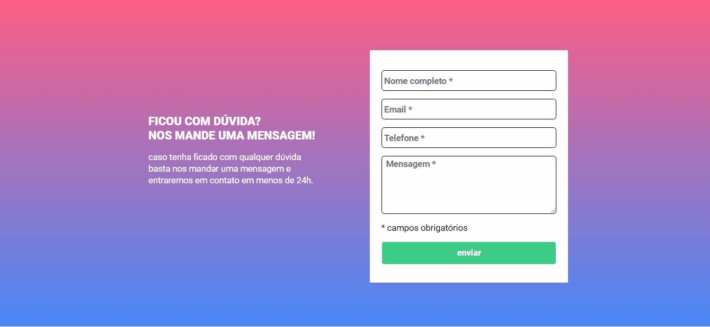

# Formulário
## Descrição
Exercício desenvolvido durante o módulo de JavaScript no curso DevQuest . O design foi tirado do Figma.

## Objetivo
O exercício tinha o objetivo de práticar a linguagem js. 
- O formulário deveria ser feito com validação apenas no javascript.
- Ao clicar para enviar o formulário, se caso
algum campo não estivesse preenchido, a borda
do input deveria ficar vermelha e uma mensagem
de "campo obrigatório" deveria aparecer embaixo
do campo que não foi preenchido.
- O fundo do formulário deve ser feito usando a
imagem em anexo na aula.
- Quando o campo estivesse preenchido a borda do input deveria ficar verde.
## Técnologias utilizadas
- HTML
- CSS
- JavaScript
## Layout
